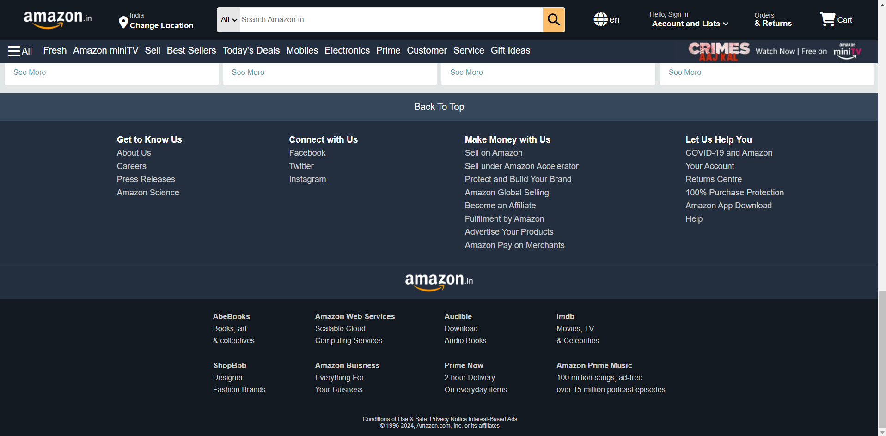

# Amazon Clone

A UI/UX replica of Amazon built using only HTML and CSS. This project is a static front-end clone that visually mimics Amazon's website layout without any backend functionality.

## Features

- **Amazon-Like Design**: A pixel-perfect replica of Amazon’s homepage layout.
- **Responsive UI**: Adaptable design for desktop and mobile devices.
- **Static Buttons**: Includes dummy buttons without functional backend logic.
- **Pure HTML & CSS**: No JavaScript or dynamic content involved.

## Demo



## Installation

1. **Clone the Repository:**

   ```bash
   git clone https://github.com/CharlieCoder404/amazon_clone.git
   cd amazon_clone
   ```

2. **Open the Project:**

   Simply open the `index.html` file in your web browser.

## Usage

- **Explore UI Components:** Navigate through the static layout to experience the Amazon-like design.
- **Click Dummy Buttons:** Interact with buttons that do not perform any backend actions.

## Technologies Used

- **HTML5**
- **CSS3**

## Acknowledgements

- Inspired by Amazon’s web design.
